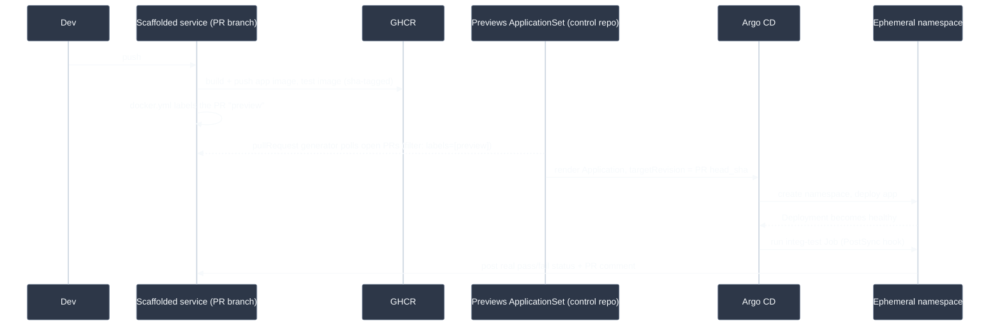

# Golden Path Architecture

How a service scaffolded from the `http-service` template actually works end to
end — not the code you write, but the platform machinery underneath it: what
happens on every push, and which repo owns which piece.

## Repositories

| Repo | Holds |
| --- | --- |
| A scaffolded service (this template's output) | Application code, Dockerfile, `k8s/` base, CI |
| [application-argocd-control](https://github.com/lukasb27/application-argocd-control) | The persistent Argo CD `Application` for `main` for every scaffolded service, plus — for `template-version: v2` and later — one previews `ApplicationSet` per service that generates the ephemeral, per-PR `Application`s directly |
| This repo (`backstage-templates`) | The `http-service` template itself |

## Request path (`template-version: v2`+, current default)

A push to a PR branch in a scaffolded service builds and pushes two images to
GHCR (the app image and a test image, both `sha`-tagged), then `docker.yml`
labels the PR `preview` once both have finished pushing. The service's
previews `ApplicationSet` — created once, at scaffold time, in the control
repo — polls open PRs via Argo CD's built-in `pullRequest` generator, and for
any PR carrying that label, renders an Argo CD `Application` pinned to the
PR's exact commit SHA (not the branch name, which a force-push would leave
stale). Argo CD picks that up, creates a namespace, deploys the app, and runs
the integration-test Job as a `PostSync` hook — only once the Deployment is
actually healthy, not racing its startup.

### `template-version: v1` (legacy — `lukas-test` only)

Services scaffolded before this migration keep working exactly as before:
`ephemeral-env.yml`, frozen behind the `v1` git tag on this repo (deleted from
`main`, but `@v1`-pinned CI calls still resolve it), polls GHCR for the PR's
branch-tagged images, hand-renders an `Application` manifest, and `git push`es
it into the control repo; `cleanup.yml` reverses this on PR close. Exactly one
real service, `lukas-test`, runs on this path — see
[the ApplicationSet migration ADR](argocd-applicationset-migration-adr.md) for
the bugs this version has (mutable branch reference, duplicated slug logic)
and why they aren't being backported to it.

The integration-test Job talks to the app over its in-cluster Service DNS name,
not through the Ingress — that's real bug surface (the Service `selector` has to
actually match the Deployment's pod labels), and it's the only path a database or
a sibling API could be reached over too.

The `%%{init: ...}%%` block below forces a specific dark theme rather than
relying on the rendering addon's light/dark auto-detection, which renders this
diagram's text unreadable (dark-on-dark) in this instance regardless of the
Backstage UI's own theme.

