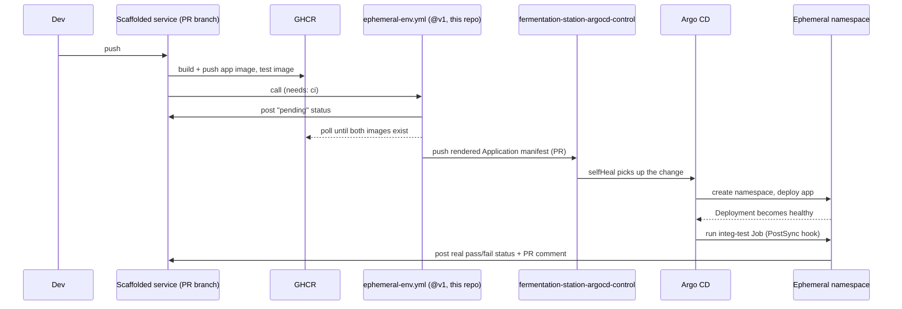

# Golden Path Architecture

How a service scaffolded from the `http-service` template actually works end to
end — not the code you write, but the platform machinery underneath it: what
happens on every push, and which repo owns which piece.

## Repositories

| Repo | Holds |
| --- | --- |
| A scaffolded service (this template's output) | Application code, Dockerfile, `k8s/` base, CI |
| [fermentation-station-argocd-control](https://github.com/lukasb27/fermentation-station-argocd-control) | The persistent Argo CD `Application` for `main`, and one per open PR, for every scaffolded service |
| This repo (`backstage-templates`) | The `http-service` template itself, and the `ephemeral-env.yml` reusable workflow every scaffolded service's CI calls by version (`@v1`) |

## Request path

A push to a PR branch in a scaffolded service builds and pushes two images to
GHCR (the app image and a test image), then asks the referenced
`ephemeral-env.yml` workflow (this repo, called by version) to render and push
an Argo CD `Application` manifest into the control repo. Argo CD picks that up,
creates a namespace, deploys the app, and runs the integration-test Job as a
`PostSync` hook — only once the Deployment is actually healthy, not racing its
startup.

The integration-test Job talks to the app over its in-cluster Service DNS name,
not through the Ingress — that's real bug surface (the Service `selector` has to
actually match the Deployment's pod labels), and it's the only path a database or
a sibling API could be reached over too.

## Why this lives here, not in every scaffolded service

This flow is identical for every service the `http-service` template produces.
Documenting it once here, rather than copying it into each generated
`docs/architecture.md`, means it can't drift out of sync with reality one
scaffolded repo at a time as the flow evolves. Each scaffolded service's own docs
link back here for the platform mechanics, and cover only what's actually
specific to that service.
