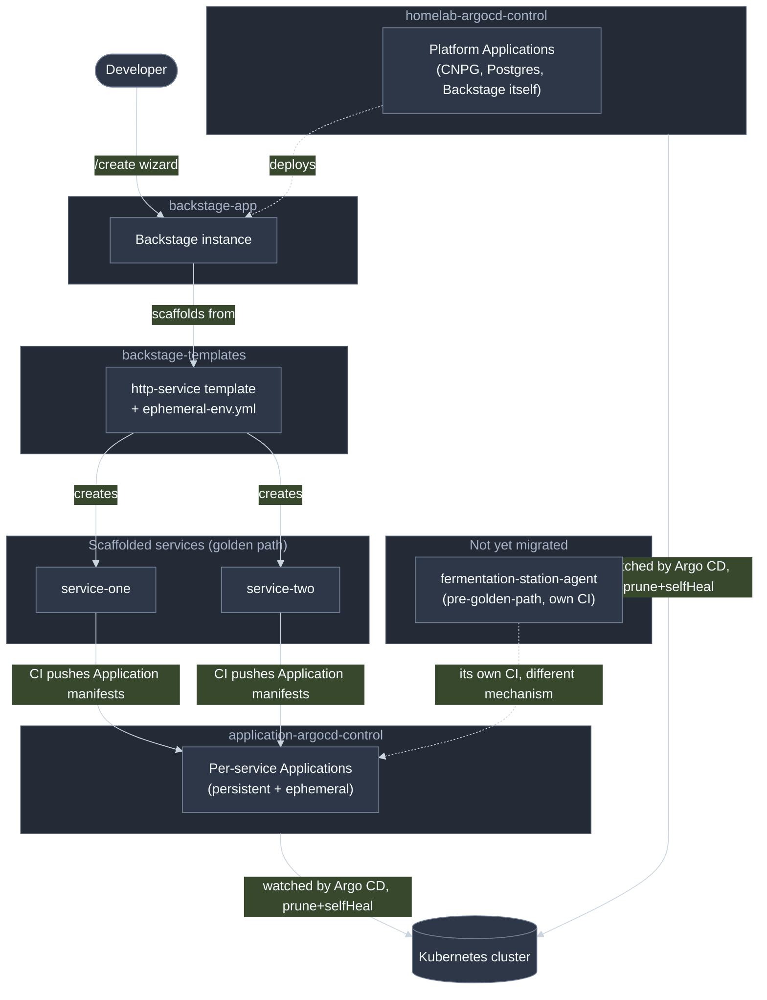

# Platform Overview

[Architecture](architecture.md) explains how one scaffolded service's request
path works. This zooms out one level further: the five repos that make up the
whole golden-path system, what each one owns, and — the thing most likely to
cause confusion — why there are **two** Argo CD control repos, not one.

## The five repos

| Repo | Owns |
| --- | --- |
| [backstage-app](https://github.com/lukasb27/backstage-app) | The Backstage instance itself — the portal, the `/create` wizard, the catalog |
| This repo (`backstage-templates`) | The `http-service` golden-path template, and this documentation |
| [homelab-argocd-control](https://github.com/lukasb27/homelab-argocd-control) | **Core platform** Argo CD — long-lived, human-reviewed infrastructure: the CNPG operator, the Postgres cluster backing Backstage's own database, Backstage itself |
| [application-argocd-control](https://github.com/lukasb27/application-argocd-control) | **Application-level** Argo CD — one persistent + N ephemeral Applications per golden-path service, created and destroyed automatically by each service's own CI |
| Scaffolded services (many) | Application code, `k8s/` base, CI — one repo per service, all built from this template |

## Why two Argo CD repos, not one

Short version: churn rate and blast radius are different enough that mixing
them is a real risk, not just an organizational preference. Full reasoning,
including why merging them was explicitly considered and rejected, is in
[homelab-argocd-control's ADR](https://github.com/lukasb27/homelab-argocd-control/blob/main/docs/two-argocd-repos-adr.md).
The short version: `homelab-argocd-control` changes rarely and deliberately;
`application-argocd-control` changes constantly and automatically, driven by
every open/close of every PR across every service. Keeping the second
category's routine churn away from the first category's critical
infrastructure is the entire point of the split.

## Extending the scaffolder with custom logic

When a template step needs to do something no stock Backstage action covers —
[`goldenPath:restrictPrCreation`](https://github.com/lukasb27/backstage-app/blob/main/packages/backend/src/modules/goldenPathActions.ts)
is the precedent to follow: a custom **scaffolder action**, registered into the
Scaffolder plugin's action registry via the `scaffolderActionsExtensionPoint`
extension point in a `backend-app`-side backend module, called from
`template.yaml` by `action: goldenPath:<name>` exactly like a stock action
(`github:branch-protection:create`, `publish:github`, ...). It's invoked
in-process by the scaffolder's task-execution engine when a template step names
it — no new route or externally-callable interface, just another entry in the
same action registry every built-in action already goes through — using
whichever credentials the handler is given (usually the same GitHub integration
credential `github:branch-protection:create` already uses). See
[`argocd-notifications-gate-adr.md`](./argocd-notifications-gate-adr.md) for why
this is the right tool here and *not* the same thing as the rejected
`goldenPath:setRepoSecrets` idea (that one was about distributing new secrets
into every scaffolded repo; this is about Backstage doing something once, itself,
at scaffold time — no per-repo secret involved either way).

The one real cost: it lives in `backstage-app`, not this repo, so a change needs
an image rebuild + Argo CD rollout of Backstage itself before a template can use
it — slower than editing a skeleton file, but the only way to reach credentials
or logic a workflow running inside the scaffolded repo can't.

## Legacy services

`fermentation-station-agent` predates the golden path entirely — it has its
own bespoke CI (Jinja2-templated manifests, its own test framework), pushes
images to Docker Hub instead of GHCR, and was never migrated onto this
template. It still registers into `application-argocd-control` (that repo
already existed and served this exact purpose before the golden path did),
but everything else about how it's built and deployed is unrelated to
everything documented here. Migrating it onto the golden path is tracked as
future work, not done.
