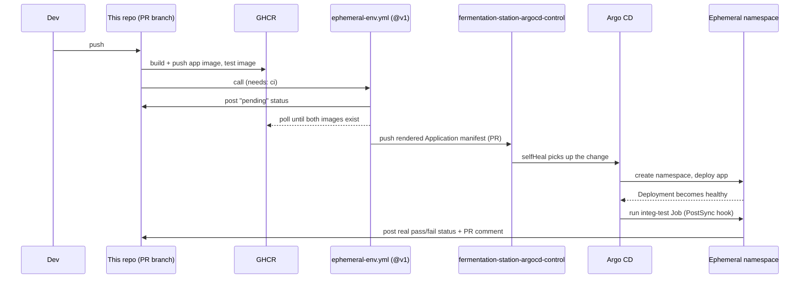

# Architecture

## Repositories

| Repo | Holds |
| --- | --- |
| This repo | Application code, Dockerfile, `k8s/` base, CI |
| [fermentation-station-argocd-control](https://github.com/lukasb27/fermentation-station-argocd-control) | The persistent Argo CD `Application` for `main`, and one per open PR |
| [backstage-templates](https://github.com/lukasb27/backstage-templates) | The template this repo was scaffolded from, and the `ephemeral-env.yml` reusable workflow this repo's CI calls by version (`@v1`) |

## Request path

A push to a PR branch builds and pushes two images to GHCR (the app image and a
test image), then asks the referenced `ephemeral-env.yml` workflow to render and push
an Argo CD `Application` manifest into the control repo. Argo CD picks that up,
creates a namespace, deploys the app, and runs the integration-test Job as a
`PostSync` hook — only once the Deployment is actually healthy, not racing its
startup.

The integration-test Job talks to the app over its in-cluster Service DNS name,
not through the Ingress — that's real bug surface (the Service `selector` has to
actually match the Deployment's pod labels), and it's the only path a database or a
sibling API could be reached over too.

## Day 2

This repo is yours from here — drift in application code, the Dockerfile, resource
values, tests, and docs is expected and correct. Two things are platform contract,
not this service's business:

1. **The template version** — the `goldenpath.lukasb27/template-version` annotation
   in `catalog-info.yaml` records what you were scaffolded from.
2. **The ephemeral-env workflow** — referenced by version (`@v1`), not copied. Don't
   inline its logic here; if it needs to change, that change happens once, upstream.
